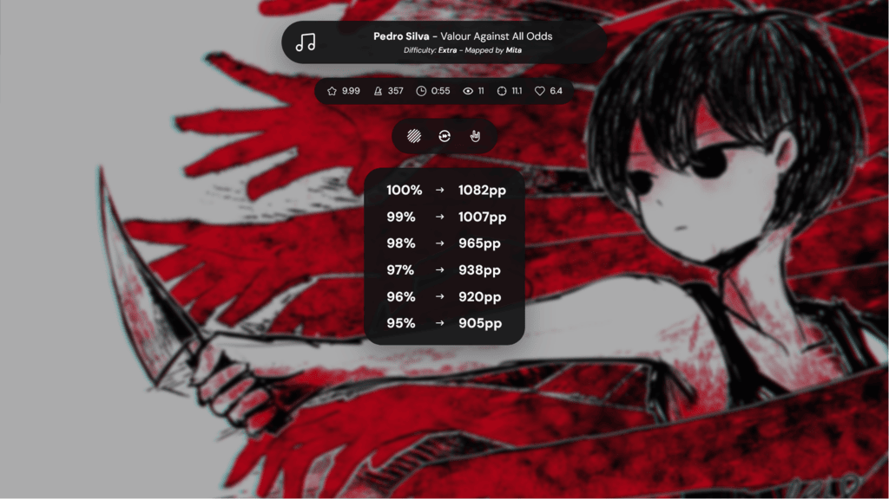
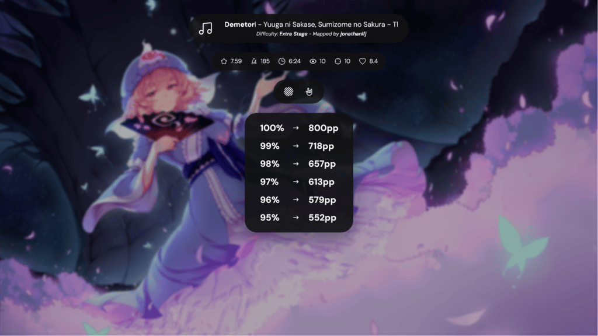

# PP Blossom

## Features

- Fullscreen dashboard designed for song select on a second monitor.
- PP preview for 100%, 99%, 98%, 97%, 96%, and 95% accuracy.
- Uses tosu-provided PP values for the selected beatmap and active mods.
- Displays beatmap metadata, map stats, active mods, and beatmap background.

## Development

This overlay is static HTML, CSS, and JavaScript. It uses the official quickstart websocket helper copied from `quickstart/js/socket.js`.

## Credits / Assets

- Overlay source code: Copyright (c) 2026 rosekki, licensed under the MIT License. See [LICENSE](LICENSE).
- SVG interface icons: from [icons0](https://icons0.dev/), licensed under the MIT License.
- osu! mod icons: from [peppy/osu-resources](https://github.com/peppy/osu-resources), licensed under CC BY-NC 4.0.
- DM Sans font files: from [Google Fonts](https://fonts.google.com/specimen/DM+Sans), licensed under the SIL Open Font License 1.1.

Bundled third-party assets retain their original ownership and licenses. The MIT License in this folder applies to the overlay source code only.
